# Unlab tutorial

## Copyright and license

Copyright (c) 2026 Łukasz Szpakowski

This Source Code Form is subject to the terms of the Mozilla Public
License, v. 2.0. If a copy of the MPL was not distributed with this
file, You can obtain one at https://mozilla.org/MPL/2.0/.

## Introduction

The Unlab scripting language is a simple scripting language for GPU that operates on metrices. This
scripting language can be used to create and train neural networks. This tutorial can help you learn
this scripting language.

## Standard documentation

The standard documentation is a documentation for the standard library. This documentation isn't
generated while installation of the Unlab interpreter. If you have access to this documentation, you
should invoke the following command:

```
unlab-pkg std-doc
```

If your browser hasn't access to hidden files as Firefox from Ubuntu, you should change the
documentation path by add the following line to shell configuration (`.bashrc` for bash) before the
generation of standard documentation to browse this documentation:

```
export UNLAB_GPU_DOC_PATH=$HOME/unlab-gpu-doc
```

## Interpreter

An interpreter is a program that interprets entered lines or a script code in the Unlab scripting
language. The interpreter can work in an interactive mode or a non-interactive mode.

### Interactive mode

The interactive mode allows you to enter and edit lines which are interpreted. Also, the interactive
mode allows you to access to the command history by press the up key or the down key. The interpreter
can be ran by invoke the following command in the interactive mode:

```
unlab-gpu
```

The sample interaction in the interactive mode is here:

```
unlab-gpu:1> println("Hello world!!!")
Hello world!!!
unlab-gpu:2> function f(x)
> x + 1
> end
unlab-gpu:5> println(f(2))
3
unlab-gpu:6> quit
```

You can leave from the interpreter by invoke the `quit` command. If you want to browse the standard
documentation, you can run the `doc()` command or the `help()` command to browse the standard
documentation.

### Non-interactive mode

The non-interactive mode allows you execute scripts in the Unlab scritping language. The interpreter
can be ran by invoke the following command in the non-interactive mode for the `script.un` file:

```
unlab-gpu script.un
```

## Lines and comments

A code in the Unlab scripting language is divided to lines. The sample lines in this scriping language
are here:

```unlab
println("Hello world!!!")
x = 1 + 2
println("x = ", x)
```

The lines can be joint to one line by using the semicolon character. The sample lines which are joint
one line:

```unlab
println("Hello world!!!"); x = 1 + 2; println("x = ", x)
```

This scripting language has comments which can be used to describe the code. The comments starts with
the `#` character or the `%` character. The sample comments are here:

```unlab
# First comment.
% second comment.
x = 1 + 2 # Adds one to two.
println(x) % Prints the x value.
```

## Basic values

Basic values in the Unlab scripting language are represented by numbers, matrices, and strings.
Operators in the Unlab scripting language operates on the basic values.

### Numbers

Numbers in this scripting language can be integer numbers or floating-point numbers. The sample
integer numbers are here:

```unlab
1234
-1234
0
```

Also, the integer numbers can be in hexadecimal system. The sample integer in hexadecimal system are
here:

```unlab
0x12ab
0XABCD
0xffff
```

The sample floating-point numbers are here:

```unlab
12.34
-12.34
0.56
1.234e-5
1.234e+5
2e10
0.0
```

### Matrices

Matrices in this scripting language are 2D arrays which contain floating-point numbers. The sample
matrix is here:

```unlab
[
    1, 2, 3
    4, 5, 6
]
```

The matrix also can be written in one line. The sample matrices in single lines are here:

```unlab
[1, 2, 3; 4, 5, 6]
[1, 1.5; 2, 2.5; 3, 3.5]
[1, 2; 3, 4]
```

The matrices can have the filled rows with the filling floating-point numbers and be filled with the
filling rows by using the `fill` keyword. You can try how the matrix rows are filled with the filling
floating-point number by enter the following lines to the interpreter:

```unlab
A = [
    1 fill 3
    2, 3, 4
    5 fill 3
]
B = [1 fill 3;  2 fill 3; 3, 4, 5]
C = [1.5 fill 2; 2.5 fill 2; 3, 3.5]
println("A = ", A)
println("B = ", B)
println("C = ", C)
```

The output of the above lines is here:

```
A = [
              1           1           1
              2           3           4
              5           5           5
]
B = [
              1           1           1
              2           2           2
              3           4           5
]
C = [
         1.5000      1.5000
         2.5000      2.5000
              3      3.5000
]
```

You can try how the filled matrices are filled with the filling row by enter the following lines to
the interpreter:

```unlab
A = [
    1, 2, 3
    fill 3
]
B = [3, 2, 1; fill 3]
C = [1 fill 2; fill 3]
println("A = ", A)
println("B = ", B)
println("C = ", C)
```

The output of the above lines is here:

```
A = [
              1           2           3
              1           2           3
              1           2           3
]
B = [
              3           2           1
              3           2           1
              3           2           1
]
C = [
              1           1
              1           1
              1           1
]
```

The filling row or the filling expression is separately evaluated for each matrix row or each element.
You can use it for example generation of random matrix by enter the following line to the
interpreter:

```unlab
println([rand() fill 3; fill 2])
```

The output of the above line is here:

```
[
         0.8534      0.4617      0.9736
         0.7208      0.5610      0.1972
]
```

Some functions from the standard library can create some matrices. These functions are the `zeros`
function, the `ones` function, and the `eye` function. These function takes the number of rows and the
number of columns except the `eye` function. The `eye` function takes one number for the rows and
the columns. You can create a matrix with zeros and then show it by enter the following line to the
interpreter:

```unlab
println(zeros(2, 3))
```

The output of the above line is here:

```
[
              0           0           0
              0           0           0
]
```

You can create a matrix with ones and then show it by enter the following line to the interpreter:

```unlab
println(ones(2, 3))
```

The output of the above line is here:

```
[
              1           1           1
              1           1           1
]
```

You can create an identity matrix and then show it by enter the following line to the interpreter:

```unlab
println(eye(3))
```

The output of the above line is here:

```
[
              1           0           0
              0           1           0
              0           0           1
]
```

### Strings

Strings are texts which can be shown by the `println` function. The sample strings are here:

```
"abcdef"
"abc123"
"Hello world!!!"
""
```

### Arithmentic operators

Arithmentic operators allow you to execute the arithmetic operations on basic values. The arithmetic
operators are the `-` negation operator, the `+` addition operator, the `-` subtraction operator, the
`*` multiplication operator, and the `/` division operator. You can try how these operators work on
the integer numbers by enter the following lines to the interpreter:

```unlab
println("-1 = ", -1)
println("2 + 3 = ", 2 + 3)
println("5 - 2 = ", 5 - 2)
println("2 * 3 = ", 2 * 3)
println("5 / 2 = ", 5 / 2)
```

The output of the above lines is here:

```
-1 = -1
2 + 3 = 5
5 - 2 = 3
2 * 3 = 6
5 / 2 = 2
```

These operators also can operate on floating-point numbers. You can try how these operators work on
the floating-point numbers by enter the following lines to the interpreter:

```unlab
println("-1.0 = ", -1.0)
println("2.0 + 3.0 = ", 2.0 + 3.0)
println("5.0 - 2.0 = ", 5.0 - 2.0)
println("2.0 * 3.0 = ", 2.0 * 3.0)
println("5.0 / 2.0 = ", 5.0 / 2.0)
```

The output of the above lines is here:

```
-1.0 = -1
2.0 + 3.0 = 5
5.0 - 2.0 = 3
2.0 * 3.0 = 6
5.0 / 2.0 = 2.5000
```

These operators also can operates on matrices except the `/` division operator. The multiplication two
matrices works as in linear algebra. You can try how these operators work on the matrices by enter the
following lines to the interpreter:

```unlab
A = [1, 2, 3; 4, 5, 6]
B = [4, 5, 6; 7, 8, 9]
C = [9, 8, 7; 6, 5, 4]
D = [8, 7; 6, 5; 4, 3]
println("-A = ", -A)
println("A + B = ", A + B)
println("C - A = ", C - A)
println("A * D = ", A * D)
```

The output of the above lines is here:

```
-A = [
             -1          -2          -3
             -4          -5          -6
]
A + B = [
              5           7           9
             11          13          15
]
C - A = [
              8           6           4
              2           0          -2
]
A * D = [
             32          26
             86          71
]
```

You can used these operators for the matrices and numbers. You can try how these operators work on
the matrices and the numbers by enter the following lines to the interpreter:

```unlab
A = [1, 2, 3; 4, 5, 6]
println("A + 2 = ", A + 2)
println("A - 2 = ", A - 2)
println("A * 3 = ", A * 3)
println("A / 3 = ", A / 3)
println("3 + A = ", 3 + A)
println("3 - A = ", 3 - A)
println("2 * A = ", 2 * A)
```

The output of the above lines is here:

```
A + 2 = [
              3           4           5
              6           7           8
]
A - 2 = [
             -1           0           1
              2           3           4
]
A * 3 = [
              3           6           9
             12          15          18
]
A / 3 = [
         0.3333      0.6667           1
         1.3333      1.6667           2
]
3 + A = [
              4           5           6
              7           8           9
]
3 - A = [
              2           1           0
             -1          -2          -3
]
2 * A = [
              2           4           6
              8          10          12
]
```

Also, you can use the arithmetic operators with the dot characters which operates on elements of
matrices instead of the matrices. You can try how these operators work on the matrices by enter the
following lines to the interpreter:

```unlab
A = [1, 2, 3; 4, 5, 6]
B = [4, 5, 6; 7, 8, 9]
C = [9, 8, 7; 6, 5, 4]
println(".-A = ", .-A)
println("A .+ B = ", A .+ B)
println("C .- A = ", C .- A)
println("A .* B = ", A .* B)
println("B ./ A = ", B ./ A)
```

The output of the above lines is here:

```
.-A = [
             -1          -2          -3
             -4          -5          -6
]
A .+ B = [
              5           7           9
             11          13          15
]
C .- A = [
              8           6           4
              2           0          -2
]
A .* B = [
              4          10          18
             28          40          54
]
B ./ A = [
              4      2.5000           2
         1.7500      1.6000      1.5000
]
```

The arithmetic operators with the dot characters can operates the matrices and the numbers. You can
try how these operators work on the matrix and the numbers by enter the following lines to the
interpreter:

```unlab
A = [1, 2, 3; 4, 5, 6]
println("A .+ 2 = ", A .+ 2)
println("A .- 2 = ", A .- 2)
println("A .* 3 = ", A .* 3)
println("A ./ 3 = ", A ./ 3)
println("3 .+ A = ", 3 .+ A)
println("3 .- A = ", 3 .- A)
println("2 .* A = ", 2 .* A)
println("2 ./ A = ", 2 ./ A)
```

The output of the above lines is here:

```
A .+ 2 = [
              3           4           5
              6           7           8
]
A .- 2 = [
             -1           0           1
              2           3           4
]
A .* 3 = [
              3           6           9
             12          15          18
]
A ./ 3 = [
         0.3333      0.6667           1
         1.3333      1.6667           2
]
3 .+ A = [
              4           5           6
              7           8           9
]
3 .- A = [
              2           1           0
             -1          -2          -3
]
2 .* A = [
              2           4           6
              8          10          12
]
2 ./ A = [
              2           1      0.6667
         0.5000      0.4000      0.3333
]
```

Two strings can be concatated by using the `+` addition operator. You can concatenate two strings by
enter the following line to the interpreter:

```unlab
println("abc" + "def")
```

The output of the above line is here:

```
abcdef
```

### Comparison operators

Comparison operators are used to compare two numbers. The integer numbers and the floating-point
numbers can be compared. The boolean values are returned by the comparison operators. The compareson
operators are:

- `==` - equal
- `!=` - not equal
- `<` - less
- `>=` - greater than or equal to
- `>` - greater
- `<=` - less than or equal to

The matrices isn't compared by these operators. You can try how these operators work on the integer
numbers by enter the following lines to the interpreter:

```unlab
println("2 == 3 = ", 2 == 3)
println("2 == 2 = ", 2 == 2)
println("2 != 3 = ", 2 != 3)
println("2 != 2 = ", 2 != 2)
println("2 < 3 = ", 2 < 3)
println("2 >= 3 = ", 2 >= 3)
println("2 > 3 = ", 2 > 3)
println("2 <= 3 = ", 2 <= 3)
```

The output of the above lines is here:

```
2 == 3 = false
2 == 2 = true
2 != 3 = true
2 != 2 = false
2 < 3 = true
2 >= 3 = false
2 > 3 = false
2 <= 3 = true
```

You can try how these operators work on the floating-point numbers by enter the following lines to the 
interpreter:

```unlab
println("2.0 == 3.0 = ", 2.0 == 3.0)
println("2.0 == 2.0 = ", 2.0 == 2.0)
println("2.0 != 3.0 = ", 2.0 != 3.0)
println("2.0 != 2.0 = ", 2.0 != 2.0)
println("2.0 < 3.0 = ", 2.0 < 3.0)
println("2.0 >= 3.0 = ", 2.0 >= 3.0)
println("2.0 > 3.0 = ", 2.0 > 3.0)
println("2.0 <= 3.0 = ", 2.0 <= 3.0)
```

The output of the above lines is here:

```
2.0 == 3.0 = false
2.0 == 2.0 = true
2.0 != 3.0 = true
2.0 != 2.0 = false
2.0 < 3.0 = true
2.0 >= 3.0 = false
2.0 > 3.0 = false
2.0 <= 3.0 = true
```

Also, two strings can be compared by these operators. You can try how these operators work on the
strings by enter the following lines to the interpreter:

```unlab
println("abc == def = ", "abc" == "def")
println("abc == abc = ", "abc" == "abc")
println("abc != def = ", "abc" != "def")
println("abc != abc = ", "abc" != "abc")
println("abc < def = ", "abc" < "def")
println("abc >= def = ", "abc" >= "def")
println("abc > def = ", "abc" > "def")
println("abc <= def = ", "abc" <= "def")
```

The output of the above lines is here:

```
abc == def = false
abc == abc = true
abc != def = true
abc != abc = false
abc < def = true
abc >= def = false
abc > def = false
abc <= def = true
```

### Transpose operator

A transpose operator allows you to transpose the matrix. You can try how this operator works by enter
the following lines to the interpreter:

```unlab
A = [1, 2, 3; 4, 5, 6]
println("A' = ", A')
```

The output of the above lines is here:

```
A' = [
              1           4
              2           5
              3           6
]
```

## Control flow

A control flow specifies the execution order of statements. The statements can be for example
conditions or loops in the Unlab scriting language.

### Assignment statement

An assignment statement allows you to assign a value to a variable or other assignable expression by
using the `=` character. You can try how the assignment statement works by enter the following lines
to the interpreter:

```unlab
x = 1234
println("x = ", x)
```

The output of the above lines is here:

```
x = 1234
```

### If statement

If you want some statements to be conditionally executed, you can use the if statement. You can try
how the if statement works by enter the following lines to the interpreter:

```unlab
x = 1
if x > 0
    y = x + 1
    println("y = ", y)
end
```

The output of the above lines is here:

```
y = 2
```

If you want the first statements or the second statements to be executed, you can use the if statement
with the `else` keyword. The first statements are executed if the condition is fulfilled, otherwise
the second statements are executed. You can try how the if statement with the `else` keyword works by
enter the following lines to the interpreter:

```unlab
x = 2
if x == 1
    println("x is one")
else
    println("x isn't one")
end
```

The output of the above lines is here:

```
x isn't one
```

You can use the if statement for more options by using the `else` keyword and the `if` keyword. The
condition statements are executed for the first fulfilled condition or the statements after the
`else` keyword are executed. You can try how the if statement works for more options by enter the
following lines to the interpreter:

```unlab
x = 3
if x == 1
    println("x is one")
else if x == 2
    println("x is two")
else if x == 3
    println("x is three")
else
    println("x has other value")
end
```

The output of the above lines is here:

```
x is three
```

### For statement

A for statement is a loop that executes the specified number of times. The number of iterations is
specified by for example the integer range. You can try how the for statement with the integer range
works by enter the following lines to the interpreter:

```unlab
for i in 1 to 5
    println("i = ", i)
    println("i * i = ", i * i)
end
```

The output of the above lines is here:

```
i = 1
i * i = 1
i = 2
i * i = 4
i = 3
i * i = 9
i = 4
i * i = 16
i = 5
i * i = 25
```

Also, this loop can iterate over the sequence of values. You can try how the for statement with the
sequence works by enter the following lines to the interpreter:

```unlab
for i in .[ 1, 2, 4, 6 .]
    println("i = ", i)
end
```

The output of the above lines is here:

```
i = 1
i = 2
i = 4
i = 6
```

This loop indeed iterates over an iterable value and executes the statements for each element of
iterable value.

### While statement

A while statement is a loop that executes the statements for iterations until the condition isn't
fulfilled. You can try the while statement by enter the following lines to the interpreter.

```unlab
i = 1
while i <= 5
    println("i = ", i)
    println("i * i = ", i * i)
    i = i + 1
end
```

The output of the above lines is here:

```
i = 1
i * i = 1
i = 2
i * i = 4
i = 3
i * i = 9
i = 4
i * i = 16
i = 5
i * i = 25
```

### Break statement

If you want the interpreter to leave from a loop, you can use the `break` keyword as a break
statement. You can try how the break statement works by enter the following lines to the interpreter:

```unlab
for i in 1 to 10
    if i == 5
        break
    end
    println("i = ", i)
end
```

The output of the above lines is here:

```
i = 1
i = 2
i = 3
i = 4
```

### Continue statement

If you want the interpreter to skip some iterations, you can use the `continue` keyword as a continue
statement. You can try how the continue statement works by enter the following lines to the interpreter:

```unlab
for i in 1 to 10
    if i == 2 or i == 5 or i == 7 or i == 10
        continue
    end
    println("i = ", i)
end
```

The output of the above lines is here:

```
i = 1
i = 3
i = 4
i = 6
i = 8
i = 9
```

### Functions

Functions allow you to uses same code in different places. The function can have the arguments which
have different values for the different function applications. Local variables can defined in the
function body by the assignment statements. The local variable only is available in the function body.
Also, the function can return different values which are from the last statement. You can try how the
function definition with applications works by enter the following lines to the interpreter:

```unlab
function f(x, y)
    a = x * y
    b = x / y
    z = a + b
    z
end
println("f(4, 2) = ", f(4, 2))
println("f(6, 3) = ", f(6, 3))
```

The output of the above lines is here:

```
f(4, 2) = 10
f(6, 3) = 20
```

If you want to redefine function, you can use the `removevar` function to remove the function. You
can try how the `removevar` function removes the `f` function by enter the following lines to the
interpreter:

```unlab
removevar("f")
```

The sample function with the loop in the body and the sample applications are here:

```unlab
function f(N)
    x = 1
    for i in 1 to N
        x = x * i
    end
    x
end
println("f(0) = ", f(0))
println("f(5) = ", f(5))
println("f(10) = ", f(10))
```

The output of the above lines is here:

```
f(0) = 1
f(5) = 120
f(10) = 3628800
```

Also, the functions can be recursively applied. You can try how the recursion works on the fibonacci
sequence example by enter the following lines to the interpreter:

```unlab
function fib(N)
    if N == 0
        0
    else if N == 1
        1
    else
        fib(N - 2) + fib(N - 1)
    end
end
println("fib(0) = ", fib(0))
println("fib(1) = ", fib(1))
println("fib(5) = ", fib(5))
println("fib(10) = ", fib(10))
```

The output of the above lines is here:

```
fib(0) = 0
fib(1) = 1
fib(5) = 5
fib(10) = 55
```

### Return statement
A return statement leaves from the function with the return value. You can try how the return
statement with the return value by enter the following lines to the interpreter:

```unlab
function f(x, y)
    if y == 0
        return 0
    end
    x / y
end
println("f(5, 2) = ", f(5, 2))
println("f(4, 0) = ", f(4, 0))
```

The output of the above lines is here:

```
f(5, 2) = 2
f(4, 0) = 0
```

If you want the function to return the none value, you can omit the return expression. You can try how
the return statement without the return value by enter the following lines to the interpreter:

```unlab
function f(x, y)
    if y == 0
        return
    end
    mod(x, y)
end
println("f(5, 2) = ", f(5, 2))
println("f(4, 0) = ", f(4, 0))
```

The output of the above lines is here:

```
f(5, 2) = 1
f(4, 0) = none
```

## More values and objects

This scripting language contains more values and objects than the basic values. These objects are
for example arrays and structures.

### Boolean values

A boolean value can be `true` or `false`. Logical operators can operate the boolean values. The
logical operators are the `not`, the `and` operator, and the `or` operator. You can try how the `not`
operator works by enter the following lines to the interpreter:

```unlab
println("not false = ", not false)
println("not true = ", not true)
```

The output of the above lines is here:

```
not false = true
not true = false
```

You can try how the `and` operator works by enter the following lines to the interpreter:

```unlab
println("false and false = ", false and false)
println("false and true = ", false and true)
println("true and false = ", true and false)
println("true and true = ", true and true)
```

The output of the above lines is here:

```
false and false = false
false and true = false
true and false = false
true and true = true
```

You can try how the `or` operator works by enter the following lines to the interpreter:

```unlab
println("false or false = ", false or false)
println("false or true = ", false or true)
println("true or false = ", true or false)
println("true or true = ", true or true)
```

The output of the above lines is here:

```
false or false = false
false or true = true
true or false = true
true or true = true
```

The boolean values can be used as conditional for the if statement or the loop. If the boolean value
is `true`, the condition is fulfilled. You can try how the boolean values work as the condition for
the if statement by enter the following lines to the interpreter:

```unlab
a = true
if a
    println("a is true")
end
b = false
if not b
    println("b is false")
end
```

The output of the above lines is here:


```
a is true
b is false
```

The logical operator can operates on other values and other objects. Also, these operators evaluate
the second operand if it is necessary.

### Ranges

Ranges can be used in the for loops because ranges are iterable values. The range can be integer or
floating-point. The sample integer ranges are here:

```unlab
1 to 5
4 to 8
1 to 0
```

The sample floating-point ranges are here:

```unlab
1.0 to 5.0
4.5 to 8.5
1.0 to 0.0
```

The range have step that is one by default. The range step is written after the `by` keyword. The
sample ranges with steps are here:

```unlab
1 to 4 by 2
4.5 to 8.0 by 0.5
5 to 1 by -1
```

You can try how the for loops with the ranges by enter the following lines to the interpreter:

```unlab
println("1 to 5:")
for i in 1 to 5
    println("i = ", i)
end
println("4.5 to 8.0 by 0.5:")
for i in 4.5 to 8.0 by 0.5
    println("i = ", i)
end
println("5 to 1 by -1:")
for i in 5 to 1 by -1
    println("i = ", i)
end
```

The output of the above lines is here:

```
1 to 5:
i = 1
i = 2
i = 3
i = 4
i = 5
4.5 to 8.0 by 0.5:
i = 4.5000
i = 5
i = 5.5000
i = 6
i = 6.5000
i = 7
i = 7.5000
i = 8
5 to 1 by -1:
i = 5
i = 4
i = 3
i = 2
i = 1
```

### Arrays

Arrays contain elements which can be any values. The array is an iterable and an indexable. The sample
array is here:

```unlab
.[
    1, 2.5, "abc"
.]
```

The array can be written in one line. The samples arrays in single lines are here:

```
.[ 1, 2.5, "abc" .]
.[ 3.5, 4, "def", true .]
.[.]
```

The index operator allows you to access to an element in an indexable object as the array. An indexing 
for numbers begins from one. You can try how the index operator works for the array by enter the
following lines to the interpreter:

```unlab
xs = .[ 1, 2.5, "abc", true .]
println("xs[1] = ", xs[1])
println("xs[3] = ", xs[3])
println("xs[4] = ", xs[4])
```

The output of the above lines is here:

```
xs[1] = 1
xs[3] = abc
xs[4] = true
```

Any values can be assigned to the element in the array. You can try how the assignment statements work
for the array elements by enter the following lines to the interpreter:

```unlab
xs = .[ 1, 2.5, "abc", true .]
xs[2] = 4
println("xs = ", xs)
xs[4] = "def"
println("xs = ", xs)
```

The output of the above lines is here:

```
xs = .[ 1 4 abc true .]
xs = .[ 1 4 abc def .]
```

The array can be used in the for loop. You can try how the for loops with the arrays works by enter
the following lines to the interpreter:

```unlab
xs = .[ 1, 2.5, "abc" .]
ys = .[ 3.5, 4, "def", true .]
println("xs:")
for x in xs
    println("x = ", x)
end
println("ys:")
for y in ys
    println("y = ", y)
end
```

The output of the above lines is here:

```
xs:
x = 1
x = 2.5000
x = abc
ys:
y = 3.5000
y = 4
y = def
y = true
```

The array can be added to other array by using the `+` addition operator. You can try how the `+`
addition operator works with the arrays by enter the following lines to the interpreter:

```
xs = .[ 1, 2.5 .]
ys = .[ "abc", true .]
zs = xs + ys
println("xs = ", xs)
println("ys = ", ys)
println("zs = ", zs)
```

The output of the above lines is here:

```
xs = .[ 1 2.5000 .]
ys = .[ abc true .]
zs = .[ 1 2.5000 abc true .]
```

The standard library contains some functions which operate on arrays. These functions are the `push`
function, the `pop` function, and the `append` function. You can try how the `push` function pushes
the values to the array by enter the following lines to the interpreter:

```unlab
xs = .[ 1, 2.5 .]
push(xs, "abc")
println("xs = ", xs)
push(xs, true)
println("xs = ", xs)
```

The output of the above lines is here:

```
xs = .[ 1 2.5000 abc .]
xs = .[ 1 2.5000 abc true .]
```

You can try how the `pop` function removes the elements from the array by enter the following lines to 
the interpreter:

```unlab
xs = .[ 1, 2.5, "abc" .]
println("pop(xs) = ", pop(xs))
println("xs = ", xs)
println("pop(xs) = ", pop(xs))
println("xs = ", xs)
println("pop(xs) = ", pop(xs))
println("xs = ", xs)
println("pop(xs) = ", pop(xs))
println("xs = ", xs)
```

The output of the above lines is here:

```
pop(xs) = abc
xs = .[ 1 2.5000 .]
pop(xs) = 2.5000
xs = .[ 1 .]
pop(xs) = 1
xs = .[.]
pop(xs) = none
xs = .[.]
```

You can try how the `append` function appends the array to other array by enter the following lines to
the interpreter:

```unlab
xs = .[ 1, 2.5 .]
append(xs, .[ "abc", true .])
println("xs = ", xs)
```

The output of the above lines is here:

```
xs = .[ 1 2.5000 abc true .]
```

### Structures

Structures contain fields which are identified by identifiers and can have any values. The structure
also is indexable. The sample structure is here:

```unlab
{
    name: "John"
    age: 20
    height: 1.8
}
```

The structure can be written in one line. The samples structures in single lines are here:

```
{ name: "John"; age: 20; height: 1.8 }
{ name: "Alice"; age: 30; height: 1.7; is_worker: true }
{}
```

You can use the dot operator to have access to the structure fields. You can try how the dot operator
works for the structure by enter the following lines to the interpreter:

```unlab
s = { name: "John"; age: 20; height: 1.8 }
println("s.name = ", s.name)
println("s.age = ", s.age)
```

The output of the above lines is here:

```
s.name = John
s.age = 20
```

You can assign any value to the structure field or create the structure field by the assignment
statement with the dot operator. You can try how the assignment statements with the dot operators work
for the structure fields by enter the following lines to the interpreter:

```unlab
s = { name: "John"; age: 20; height: 1.8 }
s.name = "Alice"
s.age = 30
s.is_worker = true
println("s = ", s)
```

The output of the above lines is here:

```
s = {
    age: 30
    height: 1.8000
    is_worker: true
    name: Alice
}
```

The index operator also can be used for the structures. The indices for the structure are strings. You
can try how the index operator works for array by enter the following lines to the interpreter:

```unlab
s = { name: "John"; age: 20; height: 1.8 }
println("s[\"name\"] = ", s.name)
println("s[\"age\"] = ", s.age)
```

The output of the above lines is here:

```
s["name"] = John
s["age"] = 20
```

The assignment statement with the index operator allows you to asign any values to the structure
fields. You can try how the assignment statements with the index operators work for the structure
fields by enter the following lines to the interpreter:

```unlab
s = { name: "John"; age: 20; height: 1.8 }
s["name"] = "Alice"
s["age"] = 30
s["is_worker"] = true
println("s = ", s)
```

The output of the above lines is here:

```
s = {
    age: 30
    height: 1.8000
    is_worker: true
    name: Alice
}
```

You can add two structure by using the `+` addition operator. You can try how the `+` addition
operator works with the structures by enter the following lines to the interpreter:

```unlab
s = { name: "John"; height: 1.8 }
t = { age: 30; height: 1.7; is_work: true }
u = s + t
println("s = ", s)
println("t = ", t)
println("u = ", u)
```

The output of the above lines is here:

```
s = {
    height: 1.8000
    name: John
}
t = {
    age: 30
    height: 1.7000
    is_work: true
}
u = {
    age: 30
    height: 1.8000
    is_work: true
    name: John
}
```

The standard library contains some functions which operate on structures. This function also is the
`append` function. You can try how the `append` function appends the structure to other structure by
enter the following lines to the interpreter:

```unlab
s = { name: "John"; height: 1.8 }
t = { age: 30; height: 1.7; is_work: true }
append(s, t)
println("s = ", s)
```

The output of the above lines is here:

```
s = {
    age: 30
    height: 1.7000
    is_work: true
    name: John
}
```

### Matrix arrays and matrix row slice

Matrix arrays are created from the matrices and allows you to access the elements by an indexing. The
matrices can't be indexed and iterated because they are in the GPU memory. The `matrixarray` function
creates the matrix array from the matrix. The elements in the matrix array are the matrix row slice
while an indexing or an iterating. The matrix array and the matrix row slice are indexable and
iterable. You can try how the index operator works for the matrix array and the matrix row slice by
enter the following lines to the interpreter:

```unlab
A = matrixarray([1, 2, 3; 4, 5, 6])
println("A[1] = ", A[1])
println("A[2][2] = ", A[2][2])
println("A[2][3] = ", A[2][3])
```

The output of the above lines is here:

```
A[1] = [ 1 2 3 ]
A[2][2] = 5
A[2][3] = 6
```

You can try how the for loops with the matrix array and the matrix row slices by enter the following
lines to the interpreter:

```unlab
A = matrixarray([1, 2, 3; 4, 5, 6])
println("A:")
for a in A
    println("a = ", a)
end
println("A[1]:")
for a in A[1]
    println("a = ", a, " for A[1]")
end
println("A[2]:")
for a in A[2]
    println("a = ", a, " for A[2]")
end
```

The output of the above lines is here:

```
A:
a = [ 1 2 3 ]
a = [ 4 5 6 ]
A[1]:
a = 1 for A[1]
a = 2 for A[1]
a = 3 for A[1]
A[2]:
a = 4 for A[2]
a = 5 for A[2]
a = 6 for A[2]
```

### Indexing and iterating for strings

Also, the string is indexable and iterable. The string element is also the string with one character.
You can try how the index operator works for the string by enter the following lines to the
interpreter:

```unlab
s = "abcdef"
println("s[1] = ", s[1])
println("s[3] = ", s[3])
println("s[5] = ", s[5])
```

The output of the above lines is here:

```
s[1] = a
s[3] = c
s[5] = e
```

You can try how the for loop with the strings works by enter the following lines to the interpreter:

```unlab
s = "abc"
t = "def"
println("s:")
for c in s
    println("c = ", c)
end
println("t:")
for c in t
    println("c = ", c)
end
```

The output of the above lines is here:

```
s:
c = a
c = b
c = c
t:
c = d
c = e
c = f
```

### Dot arithmentic operators

Arithmentic operators with the dot characters can recursively operate on the array elements and the
structure fields. You can try how these operators work on the arrays and the structures by enter the
following lines to the interpreter:

```unlab
s = { W: [1, 2; 3, 4]; a: .[ 1.5, "abc" .]; N: 2 }
t = { W: [5, 6; 7, 8]; a: .[ 2.5, "abc" .]; N: 2 }
u = { W: [8, 7; 6, 5]; a: .[ 2.5, "abc" .]; N: 2 }
println(".-s = ", .-s)
println("s .+ t = ", s .+ t)
println("u .- s = ", u .- s)
println("s .* t = ", s .* t)
println("t ./ s = ", t ./ s)
```

The output of the above lines is here:

```
.-s = {
    N: 2
    W: [
                 -1          -2
                 -3          -4
    ]
    a: .[ -1.5000 abc .]
}
s .+ t = {
    N: 2
    W: [
                  6           8
                 10          12
    ]
    a: .[ 4 abc .]
}
u .- s = {
    N: 2
    W: [
                  7           5
                  3           1
    ]
    a: .[ 1 abc .]
}
s .* t = {
    N: 2
    W: [
                  5          12
                 21          32
    ]
    a: .[ 3.7500 abc .]
}
t ./ s = {
    N: 2
    W: [
                  5           3
             2.3333           2
    ]
    a: .[ 1.6667 abc .]
}
```

You can try how these operators work on the array, the structure, and the numbers by enter the
following lines to the interpreter:

```unlab
s = { W: [1, 2; 3, 4]; a: .[ 1.5, "abc" .]; N: 2 }
println("s .+ 2 = ", s .+ 2)
println("s .- 2 = ", s .- 2)
println("s .* 3 = ", s .* 3)
println("s ./ 3 = ", s ./ 3)
println("3 .+ s = ", 3 .+ s)
println("3 .- s = ", 3 .- s)
println("2 .* s = ", 2 .* s)
println("2 ./ s = ", 2 ./ s)
```

The output of the above lines is here:

```
s .+ 2 = {
    N: 2
    W: [
                  3           4
                  5           6
    ]
    a: .[ 3.5000 abc .]
}
s .- 2 = {
    N: 2
    W: [
                 -1           0
                  1           2
    ]
    a: .[ -0.5000 abc .]
}
s .* 3 = {
    N: 2
    W: [
                  3           6
                  9          12
    ]
    a: .[ 4.5000 abc .]
}
s ./ 3 = {
    N: 2
    W: [
             0.3333      0.6667
                  1      1.3333
    ]
    a: .[ 0.5000 abc .]
}
3 .+ s = {
    N: 2
    W: [
                  4           5
                  6           7
    ]
    a: .[ 4.5000 abc .]
}
3 .- s = {
    N: 2
    W: [
                  2           1
                  0          -1
    ]
    a: .[ 1.5000 abc .]
}
2 .* s = {
    N: 2
    W: [
                  2           4
                  6           8
    ]
    a: .[ 3 abc .]
}
2 ./ s = {
    N: 2
    W: [
                  2           1
             0.6667      0.5000
    ]
    a: .[ 1.3333 abc .]
}
```

### Functions

A function also is an object that can be assigned to other variables and can be passed as argument to
other function. You can try how the function is assigned to other variable by enter the following
lines to the interpreter:


```unlab
function f(x, y)
    x + y
end
g = f
println("f(1, 2) = ", f(1, 2))
println("g(1, 2) = ", g(1, 2))
println("g(3, 4) = ", g(3, 4))
```

The output of the above lines is here:

```
f(1, 2) = 3
g(1, 2) = 3
g(3, 4) = 7
```

You can try how the function is passed to the `find` function by by enter the following lines to the
interpreter:

```unlab
function f(d, x)
    mod(x, d) == 0
end
xs = .[ 1, 2, 3, 5, 6 .]
ys = .[ 1, 3, 6 .]
println("found index = ", find(xs, 3, f), " for xs")
println("found index = ", find(ys, 4, f), " for ys")
```

The output of the above lines is here:

```
found index = 3 for xs
found index = none for ys
```

### Errors and none values

An error is an object that informs about the function error. The errors are created by the `error`
function that takes the error kind and the error message. If you apply some function that can return
an error in other function, you can use the `?` operator of error proparagion that can leave from
other function with the returned error by some function. If the operand of this operator is an error,
this operator leaves the function with the error. You can try how the `?` operator of error
propagation works for the error by enter the following lines to the interpreter:

```unlab
function one_or_err(x)
    if x == 1
        x
    else
        error("one_or_err", "x isn't one")
    end
end
function f(x, y)
    x = one_or_err(x)?
    x + y
end
println("f(1, 2) = ", f(1, 2))
println("f(1, 3) = ", f(1, 3))
println("f(2, 3) = ", f(2, 3))
```

The output of the above lines is here:

```
f(1, 2) = 3
f(1, 3) = 4
f(2, 3) = x isn't one
```

A none value is a value that can use to inform about for example no element. The none value can be
used in the functionsw which should return nothing. The `?` operator of error propagation also can be
used for the none values. You can try how the `?` operator of error propagation works for the error by
enter the following lines to the interpreter:

```unlab
function one_or_none(x)
    if x == 1
        x
    else
        none
    end
end
function f(x, y)
    x = one_or_none(x)?
    x + y
end
println("f(1, 2) = ", f(1, 2))
println("f(1, 3) = ", f(1, 3))
println("f(2, 3) = ", f(2, 3))
```

The output of the above lines is here:

```
f(1, 2) = 3
f(1, 3) = 4
f(2, 3) = none
```

If the `?` operator of error propagation is used outside the function and the operand of this operator 
is an error, this operator prints the error.

### References

Arrays and structures are mutable objects which are referred by the references as the values. The
mutable object can be referred by many references. You can try how references works for the array by
enter the following lines to the interpreter:

```unlab
xs = .[ 1, 2.5, "abc" .]
ys = xs
ys[2] = 3
println("xs = ", xs)
println("ys = ", ys)
```

The output of the above lines is here:

```
xs = .[ 1 3 abc .]
ys = .[ 1 3 abc .]
```

You can try how references works for the structure by enter the following lines to the interpreter:

```unlab
s = { name: "John"; age: 20; height: 1.8 }
t = s
t.age = 30
println("s = ", s)
println("t = ", t)
```

The output of the above lines is here:

```
s = {
    age: 30
    height: 1.8000
    name: John
}
t = {
    age: 30
    height: 1.8000
    name: John
}
```

The interpreter counts the number of references for each mutable object. If the number of references
for mutable object is zero, mutable object is freed. If the cycle reference occurs, the number of
references will never be zero and the mutable object will never be freed. Therefore you should weak
reference. The weak reference doesn't increase the number of reference for the mutable object. The
function the `weak` function creates a weak reference. You can try how the weak reference works
by enter the following lines to the interpreter:

```unlab
e1 = {
    prev: none
    next: none
    x: 1
}
e2 = {
    prev: none
    next: none
    x: 2
}
e1.next = e2
e2.prev = weak(e1)
println("e1 = ", e1)
println("e2 = ", e2)
```

The output of the above lines is here:

```
e1 = {
    next: {
        next: none
        prev: weak(...)
        x: 2
    }
    prev: none
    x: 1
}
e2 = {
    next: none
    prev: weak(...)
    x: 2
}
```

The weak reference can be converted to normal reference by the `strong` function. You can try how the
`strong` function works by enter the following lines to the interpreter:

```unlab
e1 = {
    prev: none
    next: none
    x: 1
}
e2 = {
    prev: none
    next: none
    x: 2
}
e1.next = e2
e2.prev = weak(e1)
println("strong(e2.prev) = ", strong(e2.prev))
```

The output of the above lines is here:

```
strong(e2.prev) = {
    next: {
        next: none
        prev: weak(...)
        x: 2
    }
    prev: none
    x: 1
}
```

## Modules

Modules allow you to arrange your code by devide code to the parts as your modules. Variables,
functions, and other modules can be in the module.

### Module definition

You can define the module with variables, functions, and other modules. The sample module definition
is here:

```unlab
module company
    module programmers
        function work()
            println("I programme")
        end

        function employees()
            .[ "John", "Bob" .]
        end
    end

    module admins
        function work()
            println("I administer")
        end

        function employees()
            .[ "Alice" .]
        end
    end

    name = "ProgComp"

    function work()
        println("I work")
    end
end
```

### Access to variables and functions

You can have access to the variables and the functions which are in your modules by using the `::`
character sequence. The `::` character sequences join the identifiers to the name that can be
relative or absolute. The names are like the paths to files and/or directories except the path
separator. The relative name has the module identifiers and the last identifier that refers to the
variable or the function. The sample relative names for the root module are here:

```unlab
company::work
company::admins::employees
company::programmers::work
company::name
```

The interpreter searches the module of variable or function from the current module and then
searches the module of variable or function from the root module for the relative names. The sample
relative names for the `company` module are here:

```unlab
work
admins::employees
programmers::work
name
```

If you want to have sure that the module of variable or function is searched from the root module, you
use the absolute names. The absolute names start with the `root` keyword. The sample absolute names
are here:

```unlab
root::company::work
root::company::admins::employees
root::company::programmers::work
root::company::name
```

If you want to access to variable with same identifier as the local variable in the function module,
you use the `::` character sequence before the variable identifier.

### Import functions

Import functions allow you access to variables, functions, and other module by same identifiers. If
you import variables, functions, or other modules; they will be available in the current module. You
can import the variables and the functions by using the `usevar` function. This function takes the
name for the variable or the function and can take a new identifier for variable or function. The
variable or the function is available in the current module by using the new identifier if the new
identifier is passed. The sample variable imports are here:

```unlab
usevar("company::programmers::work")
usevar("company::admins::employees", "admin_employees")
usevar("company::name")
```

Also, you can import all variables and all functions from the specified module by using the `usevars`
function. This function takes the name for the specified module. The sample import of all variables
and all functions is here:

```unlab
usevars("company::programmers")
```

Also, you can import the modules by using the `usemod` function. This function takes the name for the
module and can take a new identifier for the module. The module is available in the current module by
using the new identifier if the new identifier is passed. The sample module imports are here:

```unlab
usemod("company::programmers", "workers")
usemod("company::admins")
```

Also, you can import all modules from the specified module by using the `usemods` function. This
function takes the name for the specified module. The sample import of all modules is here:

```unlab
usemods("company")
```

## Plotting

The standard library contains the functions to plotting which draw charts and/or histograms. The
charts and the histograms allow you to visualize data and operation results.

If you enter the application of plotting function to script file, you should adds the following lines
after the application of plotting function:

```unlab
println("Press enter:")
readline()?
```

The `readline` function reads line from the standard input. If the `readline` function isn't used, the
script automatically closes a window with the chart or the histogram while exit.

### 2D charts

The `plot` function allows you to draw 2D charts. This function can take the iterable objects or the
iterable object with the function. You can try how this function draw chart the iterable object with
the function by enter the following lines to the interpreter:

```unlab
chart = {
    x: .[ -4.0, 4.0 .]
    y: .[ -1.0, 1.0 .]
}
plot(chart, -4.0 to 4.0 by 0.1, sin, ",sin(x)")?
```

The result of the above lines is here:

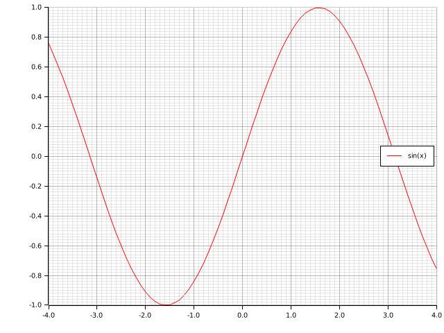

You can try how this function draw chart two iterable objects by enter the following lines to the
interpreter:

```unlab
chart = {
    x: .[ -4.0, 4.0 .]
    y: .[ -1.0, 1.0 .]
}
X = rowvector(-4.0 to 4.0 by 0.1)
Y = cos(X)
plot(chart, matrixarray(X)[1], matrixarray(Y)[1], ",Y")?
```

The result of the above lines is here:

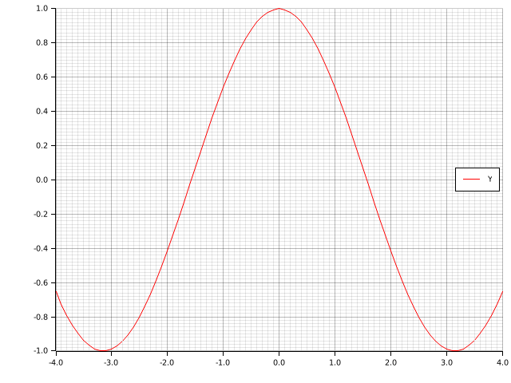

### 3D charts

The 3D charts are drawn by the `plot3` function. This function can take the iterable objects or the
iterable object with two functions for lines. You can try how this function draw chart the iterable
object with two functions for line by enter the following lines to the interpreter:

```unlab
chart = {
    x: .[ -2.0, 2.0 .]
    y: .[ -2.0, 2.0 .]
    z: .[ -2.0, 2.0 .]
}
function sin10(x)
    sin(x * 10)
end
function cos10(x)
    cos(x * 10)
end
plot3(chart, sin10, -2.0 to 2.0 by 0.025, cos10, ",line")?
```

The result of the above lines is here:

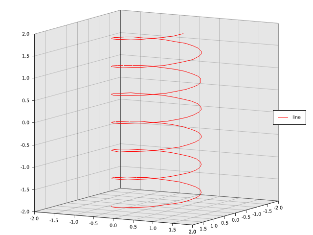

You can try how this function draw chart two iterable objects for line by enter the following lines to
the interpreter:

```unlab
chart = {
    x: .[ -2.0, 2.0 .]
    y: .[ -2.0, 2.0 .]
    z: .[ -2.0, 2.0 .]
}
X = rowvector(-2.0 to 2.0 by 0.025)
Y = cos(X * 10.0)
Z = sin(X * 10.0)
plot3(chart, matrixarray(X)[1], matrixarray(Y)[1], matrixarray(Z)[1], ",line")?
```

The result of the above lines is here:

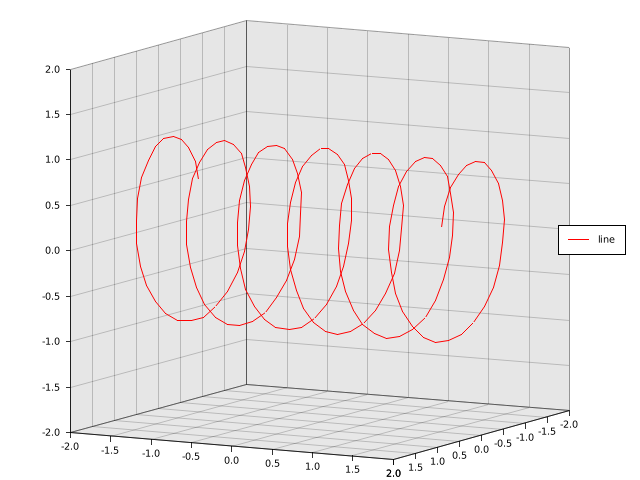

This function can take iterable objects or two iterable objects with the function for surfaces. You
can try how this function draw chart two iterable objects with the functions for surface by enter the
following lines to the interpreter:

```unlab
chart = {
    x: .[ -3.0, 3.0 .]
    y: .[ -3.0, 3.0 .]
    z: .[ -3.0, 3.0 .]
}
function f(x, y)
    cos(x * x + y * y)
end
plot3(chart, -3.0 to 3.0 by 0.1, f, -3.0 to 3.0 by 0.1, "sxz,surface")?
```

The result of the above lines is here:

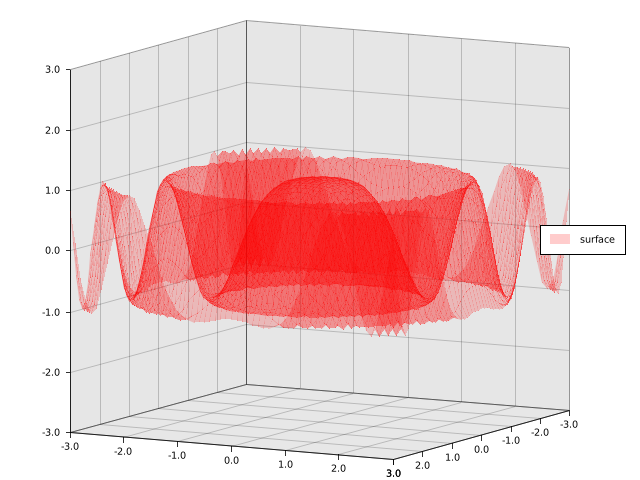

You can try how this function draw chart two iterable objects for surface by enter the following lines
to the interpreter:

```unlab
chart = {
    x: .[ -3.0, 3.0 .]
    y: .[ -3.0, 3.0 .]
    z: .[ -3.0, 3.0 .]
}
X = rowvector(-3.0 to 3.0 by 0.1)
Z = colvector(-3.0 to 3.0 by 0.1)
X1 = repeat(X, columns(X))
Z1 = repeat(Z, rows(Z))
Y = sin(X1 .* X1 + Z1 .* Z1)
plot3(chart, matrixarray(X)[1], matrixarray(Y), matrixarray(Z')[1], "sxz,surface")?
```

The result of the above lines is here:

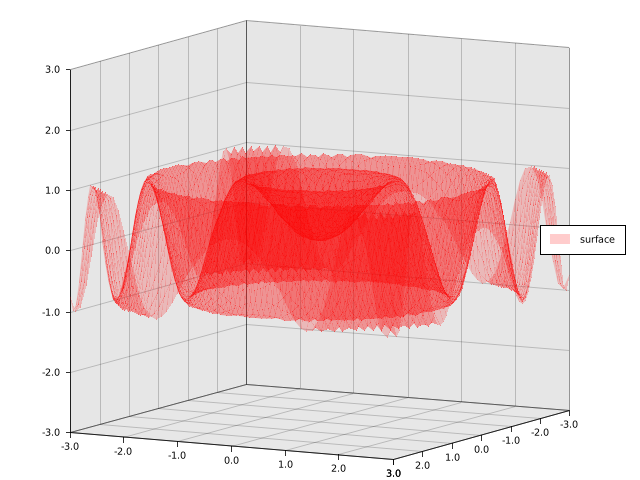

### Histograms

The `histogram` function or the `hist` function allows you to draw histogram. These functions can take
the iterable object with data. You can try how the `histogram` function draw histogram the iterable
object with data by enter the following lines to the interpreter:

```unlab
chart = {
    x: 1 to 3
    y: .[ 0, 9 .]
}
D = .[ 1, 1, 2, 2, 1, 3, 3, 2, 2, 1, 1, 2, 2, 2, 3, 3, 1, 2, 3 .]
histogram(chart, D, "")?
```

The result of the above lines is here:

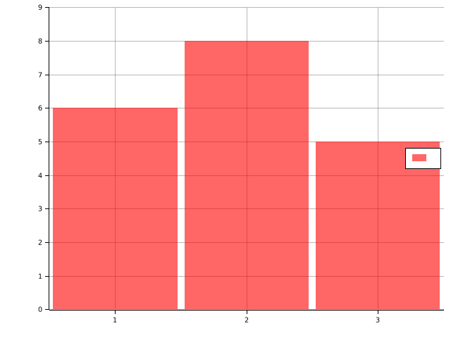

## Neural networks

This scripting language is created for neural networks. We will create and train neural netoworks to
generate and recognize the trigonometric functions.

### Library installation

We will use the `github.com/luckboy/unn` library that allows you to create and train neural netowrk.
You can install this library by invoke the following command:

```
unlab-pkg install github.com/luckboy/unn
```

### Library usage

Libraries can be loaded by the `uselib` function that loads the library if the library isn't loaded.
You can load the `github.com/luckboy/unn` library by enter the following line to the interpreter:

```unlab
uselib("pl.luckboy/unn")
```

Also, you can import modules and functions for this library by enter the following lines to the
interpreter:

```unlab
usemods("pl_luckboy_unn")
usevars("pl_luckboy_unn")
```

### Generate training data

Neural networks need the training data to learning. The following lines generate the training data for
our neural network:

```unlab
X = eye(2)
r = -3.0 to 3.0 by 0.1
YA = .[.]
push(YA, matrixarray(sin(rowvector(r)))[1])
push(YA, matrixarray(cos(rowvector(r)))[1])
YT = matrix(YA)
Y = YT'
```

### Creation of neural networks

The `github.com/luckboy/unn` library allows you to create neural networks by using the `mlpwb`
function that create Multilayer Perceptron with biases. This function takes the sizes of layers and
the activation functions for hidden layers. Other arguments of this function are a loss function and
initialization function. The following line creates the neural network for generation of trigonometric
functions:

```unlab
tfg_net = mlpwb(.[ rows(X), 100, rows(Y) .], .[ tanh .], se, xavier_init)
```

The following line creates the neural network for recognition of trigonometric functions:

```unlab
tfr_net = mlpwb(.[ rows(Y), 100, rows(X) .], .[ tanh .], cel, xavier_init)
```

### Training of neural networks

Neural network can be trained by using the `etrain` function that is in the `github.com/luckboy/unn`
library. This function takes the training data as the input data and the output data. Also, the number
of epaches and the neural network are passed to this function. This function allows you to specify
the algorithm and its parameters. If you want to save the neural network, you can specify the
diractory with the saved neural network. We will use the gradient descent algorithm. Also, we will use
the `tfgen` directory for generation of trigonometric functions. The following lines train the neural
network for generation of trigonometric functions:

```unlab
mkdir("tfgen")
tfg_net2 = etrain(50, tfg_net, X, Y, { eta: 0.1 }, alg::gd, "tfgen", true, true)?
```

The chart of loss function of neural network is here for generation of trigonometric functions:

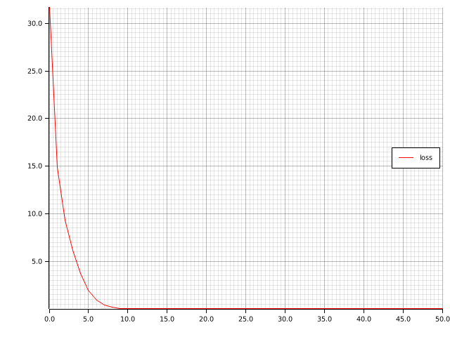

Also, we will use the `tfgen` directory for recognition of trigonometric functions. The following
lines train the neural network for recognition of trigonometric functions:

```unlab
mkdir("tfrec")
tfr_net2 = etrain(50, tfr_net, Y, X, { eta: 0.1 }, alg::gd, "tfrec", true, true)?
```

The chart of loss function of neural network is here for recognition of trigonometric functions:

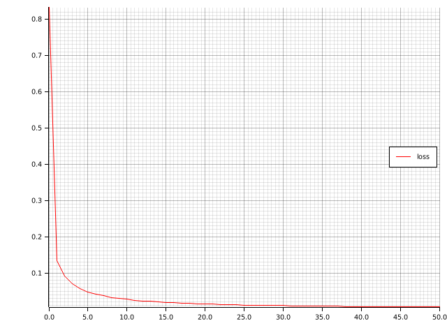

### Loading of neural networks

The neural networks can be loaded by the `load` function that loads variables. You can load the neural
network generation of trigonometric functions by the following line to the interpreter:

```unlab
tfg_net2 = (load("tfgen" + pathsep + "net.bin")?)[1]
```

You can load the neural network recognition of trigonometric functions by the following line to the
interpreter:

```unlab
tfr_net2 = (load("tfrec" + pathsep + "net.bin")?)[1]
```

### Computation of neural networks

The `compute` function computes the result of neural network. You can compute and show the result of
neural network for generation of the sine function by enter the following lines to the interpreter:

```unlab
x = [1; 0]
o = compute(tfg_net2, x, false)
chart = {
    x: .[ -3.0, 3.0 .]
    y: .[ -1.0, 1.0 .]
}
plot(chart, r, sin, ",sin(x)", r, matrixarray(o')[1], ",o")?
```

The result of the above lines is here:

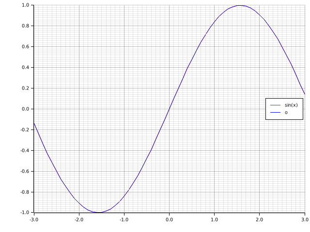

You can compute and show the result of neural network for generation of the cosine function by enter
the following lines to the interpreter:

```unlab
x = [0; 1]
o = compute(tfg_net2, x, false)
chart = {
    x: .[ -3.0, 3.0 .]
    y: .[ -1.0, 1.0 .]
}
plot(chart, r, cos, ",cos(x)", r, matrixarray(o')[1], ",o")?
```

The result of the above lines is here:

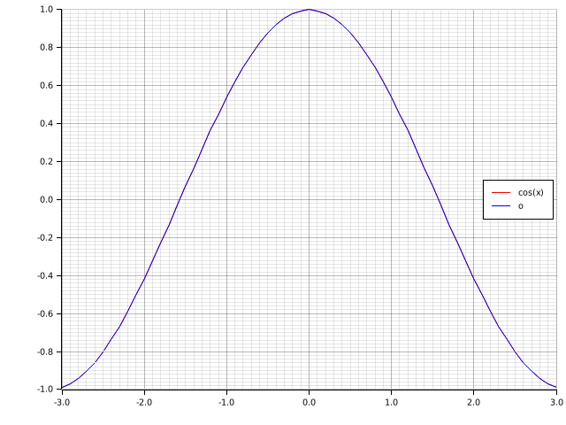

You can compute the result of neural network for recognition of the sine function by enter the
following lines to the interpreter:

```unlab
y = sin(colvector(r))
o = compute(tfr_net2, y, false)
println("o = ", o)
```

The output of the above lines is here:

```
o = [
         2.6327
        -3.2580
]
```

You can compute the result of neural network for recognition of the cosine function by enter the
following lines to the interpreter:

```unlab
y = cos(colvector(r))
o = compute(tfr_net2, y, false)
println("o = ", o)
```

The output of the above lines is here:

```
o = [
        -2.7726
         2.9751
]
```

You can compute the result of neural network for recognition of the sine function with shift by enter
the following lines to the interpreter:

```unlab
y = sin(colvector(r) + 0.1)
o = compute(tfr_net2, y, false)
println("o = ", o)
```

The output of the above lines is here:

```
o = [
         2.3066
        -2.9232
]
```

You can compute the result of neural network for recognition of the cosine function with shift by
enter the following lines to the interpreter:

```unlab
y = cos(colvector(r) + 0.1)
o = compute(tfr_net2, y, false)
println("o = ", o)
```

The output of the above lines is here:

```
o = [
        -2.9002
         3.1871
]
```

## Sample package

The package manager of this language can create package from templates. We will create sample package
with the package manager. The package manager of this language is the `unlab-pkg` program.

### Configuration

You should set the configuration of package manager for package creation. The configuration of
package manager can be set for the `github.com/luckboy` account and the `pl.luckboy` domain by invoke
the following command:

```
unlab-pkg config -a github.com/luckboy -d pl.luckboy
```

You can use your account and your domain. The account should have the git hosting service and the user
name which are separated by the `/` character. The supported git hosting service are here:

- `github.com` - [GitHub](https://github.com)
- `gitlab.com` - [GitLab](https://about.gitlab.com)
- `bitbucket.org` - [Bitbucket](https://bitbucket.org)

### Package creation

We will create the sample package with default template with tests by using the `unlab-pkg` package.
The sample package can be created by invoke the following command:

```
unlab-pkg new -t example
```

The directory tree for this package is here for the `github.com/luckboy` account and the `pl.luckboy`
domain:

```
example
├── .gitignore
├── lib
│   └── pl.luckboy
│       └── example
│           └── lib.un
├── tests
│   └── pl.luckboy
│       └── example
│           └── tests.un
└── Unlab.toml
```

The `lib/pl.luckboy/example` directory contains the `lib.un` file. The `lib.un` file is main script of
library. Also, this diectory can contain the script files which can be ran by the `run` function from
the `lib.un` file.

The `tests/pl.luckboy/example` directory contains the `tests.un` file. The `tests.un` file is main
script of tests for this library. Also, this diectory can contain the script files which can be ran by
the `run` function from the `lib.un` file.

The `Unlab.toml` is a manifest that contain information about the sample package.

The content of `.gitignore` file is here:

```
/work
```

The content of `lib/pl.luckboy/example/lib.un` file is here:

```unlab
module pl_luckboy_example
    function add(x, y)
        x + y
    end
end
```

The content of `tests/pl.luckboy/example/tests.un` file is here:

```unlab
uselib("example")

module pl_luckboy_example_tests
    tests()
    usevars("pl_luckboy_example")

    function test_add_adds()
        asserteq(4, add(2, 2))
    end
end
```

The content of `Unlab.toml` file is here:

```toml
[package]
name = "github.com/luckboy/example"

[dependencies]
```

### Git repository initialization

The sample package is the git repository that should be initialized. The git repository of sample
package can be initialized by invoke the following command in the directory of sample package:

```
git init
```

Also, you can create the first commit by invoke the following commands in the directory of sample
package:

```
git add -A
git commit -m "First commit."
```

### Depedencies

The dependencies are the packages which are required by other package. You can added dependecies by
add the following lines to the `Unlab.toml` file:

```toml
[dependencies]
"github.com/luckboy/unn" = "0.1.1"
```

You can install this depedency to the working directory by invoke the following command:

```
unlab-pkg install-deps
```

The working directory contain depedencies with the documentation that is the `work` directory in the
directory of sample package.

### Console

The package manager allows yoy to run the interpreter for the package. You can run the interpreter for
sample package by invoke the following command in the directory of sample package:

```
unlab-pkg console
```

The above command runs the interpreter with the dependencies for the sample package.

### Testing

The package manager allows you to test the library for the package. You can test the library of sample
package by invoke the following command in the directory of sample package:

```
unlab-pkg test
```

The output of above command is here:

```
Loading tests ... done
Test pl_luckboy_example_tests::test_add_adds ... ok

Test result: ok. 1 passed; 0 failed
```

The standard library has some assertion functions which can be used to testing. These function are
here:

- `assert` - an assertion error if the first argument is `false`
- `asserteq` - an assertion error if the first argument isn't equal to the second argument
- `assertne` - an assertion error if the first argument is equal to the second argument
- `assertnearlyeq` - an assertion error if the first argument isn't nearly equal to the second
  argument
- `assertnearlyne` - an assertion error if the first argument is nearly equal to the second argument

The sample application of `assert` function is here:

```unlab
assert(true)
```

The sample application of `asserteq` function is here:

```unlab
asserteq(4, 2 + 2)
```


The sample application of `assertne` function is here:

```unlab
assertne(5, 2 + 2)
```

The sample application of `assertnearlyeq` function is here:

```unlab
assertnearlyeq(pi/2, asin(0.999), 0.1)
```

The sample application of `assertnearlyne` function is here:

```unlab
assertnearlyne(pi/2, acos(0.999), 0.1)
```

### Package publication

You should create the remote repository and pushed the local repository to the remote repository
before the package publication. The package publication is the tag addition and the tag pushing to the
remote repository. The tag represents the version of package. You can publish the sample package by
invoke the following command in the directory of sample package:

```
git tag -a v0.1.0 -m "version 0.1.0"
git push -u origin v0.1.0
```
